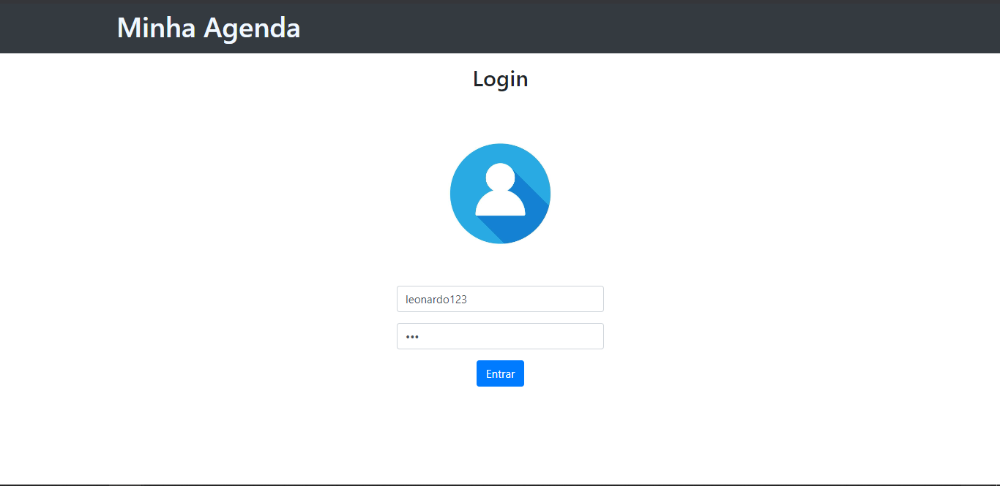
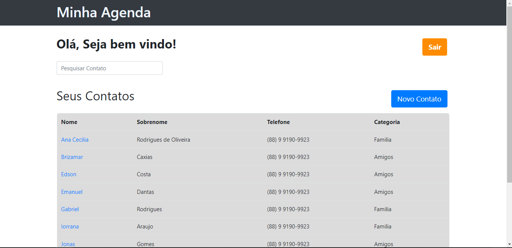

# **Agenda Django**


Olá tudo bem? Este projeto implementa uma agenda de contatos no framework Django com dados e detalhes sobre cada contato. Este projeto foi desenvolvido em conjunto com o curso [Python 3 do básico ao avançado](https://www.udemy.com/course/python-3-do-zero-ao-avancado/) e segue em parte a estrutura básica disponibilizada no site, porém com algumas modificações pessoais.

- [**Agenda Django**](#agenda-django)
  - [**Técnologias utilizadas**](#técnologias-utilizadas)
  - [**Clonando e Configurando o Projeto**](#clonando-e-configurando-o-projeto)
    - [**Clonando o respositório**](#clonando-o-respositório)
    - [**Configurando o Projeto**](#configurando-o-projeto)
    - [**Instalando as dependencias do projeto**](#instalando-as-dependencias-do-projeto)
    - [**Inicializando o projeto**](#inicializando-o-projeto)


## **Técnologias utilizadas**

No arquivo [requirements.txt](./requirements.txt) você pode encontrar todos os módulos que são necessários para rodar este projeto. Abaixo estão listadas as principais tecnologias utilizadas nesse projeto:

* Python 3.9
* Django 4.0.6
* Bootstrap 5
* HTML 5
* CSS 3

## **Clonando e Configurando o Projeto**

Assim como outros respositórios eu busquei dar um tutórial básico de como clonar e rodar este projeto na sua máquina.

### **Clonando o respositório**

Certifique-se primeiramente de ter o Git instalado na sua máquina. Se você já instalou e já conjfigrou e instalou o seu Git você pode clonar este respositório com o comando

```
    git clone https://github.com/leonhardc/agenda-django.git
```

Após terminar o procedimento acima você terá um diretório chamado `agenda-django` na sua área de trabalho. Entre nesse diretório e você verá a seguinte arvore de projeto

```
    agenda-django/
        accounts/
        agenda/
        contatos/
        media/
        templates/
```

* **agenda**: Este é o app principal do nosso projeto, é aqui onde estão as principais configurações que permitem o adequado funcionamento da nossa aplicação
* **accounts/**: Este app guarda as configurações e as implementações que permitem que nossa aplicação gerencie contas de usuários diferentes, onde cada usuário pode ter sua própria lista de contatos.
* **contatos**: Este app gerencia e implementa nossos contatos. 
* **media/**: Onde são armazenadas as medias dos contatos de cada usuário
* **templates**: Diretório onde estão os principais templates onde serão renderizadas as nossas requisições. É neste diretório também onde ficam todos os arquivos estáticos do proketo.

### **Configurando o Projeto**

Depois de clonado ainda é necessário se fazer mais alguns ajustes para que possamos rodar este projeto na sua máquina. Primeiramente vamos criar um ambiente virtual. Digite o comando abaixo no seu terminal windows:

```
     python -m venv venv 
```

Após finalizado a instalação e configuração inicial do ambiente virtual acima, podemos ativá-lo com o comando

```
    venv\Scripts\activate
```

Lembre-se de verificar se o seu ambiente virtual foi ativado. Seu ambiente estará ativado caso houver `(venv)` escrito ao lado da sua linha de comando. 

### **Instalando as dependencias do projeto**

Proximo passo é instalar as dependencias do nosso projeto. É simples, basta executar o comando abaixo no seu terminal.

```
    pip install -r requirements.txt
```

### **Inicializando o projeto**

E ai, já podemos começar a usar nossa aplicação? Infelizmente, ainda não. Primeiro temos que fazer algumas configurações iniciais como criar nosso banco de dados, preparando as migrações e aplicando elas. 

Para criar as migrações que precisam ser feitas no nosso banco execute o comando abaixo no seu terminal

```
    python manage.py makemigrations
```

Depois de criadas, precisamos aplicar nossas migrações no nosso banco de dados. Para fazer isso execute o comando:

```
    python manage.py migrate
```

Depois de feitos os passos anteriores devemos agora startar nosso servidor local antes de acessar a nossa aplicação.

```
    python manage.py runserver
```

Se tudo correu bem até aqui você verá uma mensagem parecida com:

```
    Watching for file changes with StatReloader
    Performing system checks...

    System check identified no issues (0 silenced).
    February 06, 2023 - 19:21:06
    Django version 4.0.6, using settings 'agenda.settings'
    Starting development server at http://127.0.0.1:8000/
    Quit the server with CTRL-BREAK.
```

Para acessar a aplicação digite o endereço `http://127.0.0.1:8000/` na barra de endereço do seu navegador.

Como o cadastro de usuário não foi implementado nesse projeto recomenda-se que você crie um super usuário para acessa a página inicial da aplicação. Para isso digite o seguinte comando no seu terminal e preencha as informações recomendadas. 

```
    python manage.py createsuperuser
```

Depois de criado o usuário fique a vontade para logar normalmente na página abaixo





A página inicial da aplicação é como mostra na próxima imagem 



Fique a vontade para brincar, inserir novos contatos, apagá-los e ver como são as páginas de detalhes de cada contato quando adicionamos ou não fotos para eles.

Abaixo segue um pequeno demostrativo da aplicação

<div>
    
</div>